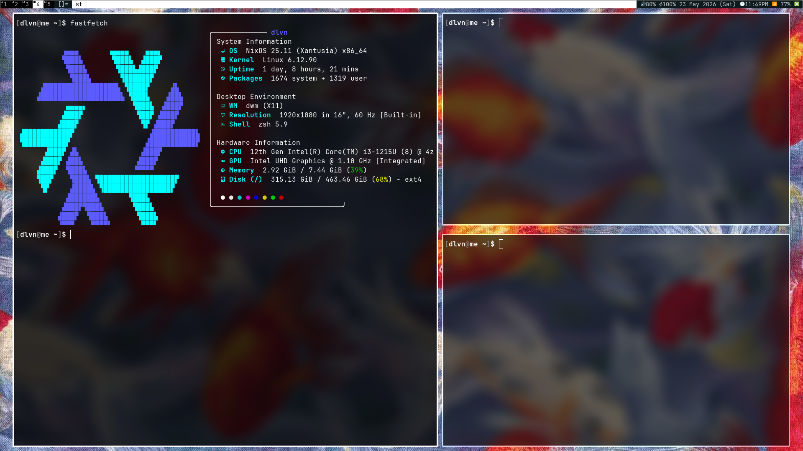

<div align="center">


# ❄️ NixOS · DWM Dotfiles

> *A minimal, suckless-driven NixOS configuration — declarative by nature, fast by design.*

[](https://nixos.org)
[](https://nixos.wiki/wiki/Flakes)
[](https://dwm.suckless.org)
[](https://neovim.io)
[](LICENSE)

</div>

---

## 📸 Preview

<div align="center">
<!--  -->
<i>[ screenshot goes here ]</i>
</div>

---

## 🖥️ System Details

| Component          | Tool                                                          |
|--------------------|---------------------------------------------------------------|
| **OS**             | NixOS                                                         |
| **Window Manager** | [dwm](https://dwm.suckless.org) (patched)                    |
| **Status Bar**     | [dwmblocks](https://github.com/torrinfail/dwmblocks) (custom scripts) |
| **Terminal**       | [st](https://st.suckless.org) (patched)                      |
| **Editor**         | [Neovim](https://neovim.io)                                  |
| **Browser**        | [qutebrowser](https://qutebrowser.org)                       |
| **File Manager**   | [lf](https://github.com/gokcehan/lf)                        |
| **PDF Viewer**     | [zathura](https://pwmt.org/projects/zathura)                 |
| **System Monitor** | [btop](https://github.com/aristocratos/btop)                 |
| **Torrent**        | [qBittorrent](https://qbittorrent.org)                       |
| **Display Server** | X11                                                           |

---

## 📁 Repository Structure

```
.
├── 📂 .config/                   # Application configs
│   ├── btop/                     # System monitor + themes
│   ├── lf/                       # Terminal file manager
│   ├── nvim/                     # Neovim config
│   │   └── lua/
│   │       ├── config/           # Core settings
│   │       └── plugins/          # Plugin declarations
│   ├── qBittorrent/              # Torrent client + RSS feeds
│   ├── qutebrowser/              # Keyboard-driven browser
│   │   ├── bookmarks/
│   │   └── greasemonkey/         # Userscripts
│   ├── x11/                      # Xorg / xinitrc config
│   └── zathura/                  # PDF & document viewer
│
├── 📂 .dotfiles/                 # NixOS system configuration
│   ├── hosts/
│   │   └── laptop/               # Laptop host definition
│   │       └── home/             # Home Manager config for laptop
│   ├── modules/
│   │   ├── home/                 # Home Manager modules
│   │   └── system/               # NixOS system modules
│   └── overlays/                 # Patched suckless tools (built via Nix)
│       ├── dmenu/
│       ├── dwm/                  # dwm + IPC patches
│       │   └── patch/
│       ├── dwmblocks/
│       └── st/                   # st + patches
│           └── patch/
│
└── 📂 .local/
    └── bin/
        └── statusbar/            # Shell scripts powering dwmblocks
```

---

## ✨ Highlights

- 🧱 **Suckless stack** — dwm, st, dmenu, dwmblocks built and patched via Nix overlays
- ❄️ **Flake-based** — fully reproducible and input-pinned
- 🏠 **Home Manager** — user environment declared in Nix alongside system config
- 📦 **Modular layout** — clean separation between system and home modules
- ⚡ **Custom statusbar** — lightweight shell scripts feeding into dwmblocks
- 🌐 **qutebrowser** — keyboard-first browsing with greasemonkey userscripts
- 📝 **Neovim** — Lua-configured, plugins and core settings cleanly separated

---

## 🚀 Installation

> **⚠️ Warning:** These are personal dotfiles — review configs before applying, especially the hardware configuration.

### 1. Clone the repo

```bash
git clone https://github.com/qzgpm/NixOS-Repo.git
cd NixOS-Repo
```

### 2. Point to your hardware

```bash
nixos-generate-config --show-hardware-config > .dotfiles/hosts/laptop/hardware-configuration.nix
```

### 3. Apply system config

```bash
sudo nixos-rebuild switch --flake .#laptop
```

### 4. Apply Home Manager

```bash
home-manager switch --flake .#<your-username>
```

---

## 🔧 Useful Commands

```bash
# Rebuild and switch
sudo nixos-rebuild switch --flake .#laptop

# Test config without switching (safe dry-run)
sudo nixos-rebuild test --flake .#laptop

# Update all flake inputs
nix flake update

# Clean up old generations
sudo nix-collect-garbage -d

# Check flake for errors
nix flake check
```

---

## 🩹 Patches

Suckless tools are patched and built through Nix overlays in `.dotfiles/overlays/`:

| Tool       | Patches Applied                         |
|------------|-----------------------------------------|
| **dwm**    | IPC, *[add your patches]*              |
| **st**     | *[add your patches]*                   |
| **dmenu**  | *[add your patches]*                   |

---

## 📜 Statusbar Scripts

Custom shell scripts in `.local/bin/statusbar/` — piped into **dwmblocks**:

| Script         | Output                    |
|----------------|---------------------------|
| `sb-battery`   | Battery % and status      |
| `sb-volume`    | Audio volume level        |
| `sb-cpu`       | CPU usage                 |
| `sb-date`      | Date and time             |
| *...add yours* |                           |

---

## 🙏 Acknowledgements

- [suckless.org](https://suckless.org) — dwm, st, dmenu
- [Misterio77/nix-starter-configs](https://github.com/Misterio77/nix-starter-configs) — flake structure reference
- [NixOS Discourse](https://discourse.nixos.org) — community & support

---

<div align="center">

*Built with ❄️ on NixOS · Suckless philosophy, Nix reproducibility*

</div>
